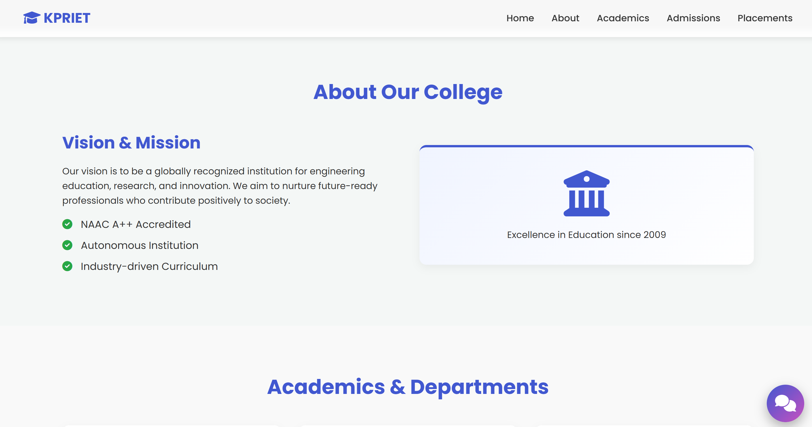
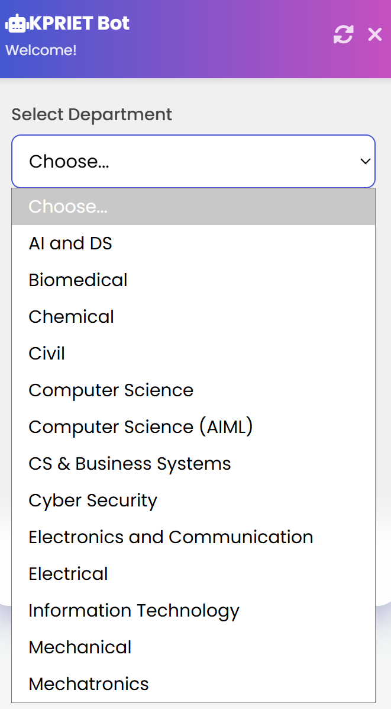
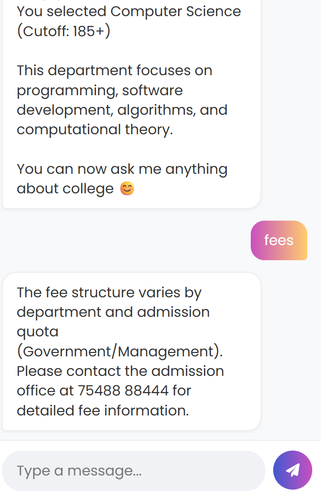

# KPRIET College Chatbot & Landing Page

A full-stack Flask web application that serves as a professional landing page for the KPR Institute of Engineering and Technology (KPRIET) and includes a highly interactive, intelligent floating chatbot widget.

## Features

- **Professional Landing Page:**
  - Modern UI with responsive grid layouts.
  - Sticky navigation bar with smooth scrolling to sections (Home, About, Academics, Admissions, Placements).
  - High-quality hero section with background image and dark overlay.
  
- **Intelligent Floating Chatbot:**
  - Floating, non-intrusive widget built with a beautiful glassmorphism aesthetic.
  - **Onboarding Flow:** Users select their department (dynamically displaying the admission cutoff) and enter their name before chatting.
  - **Machine Learning Backend:** Uses `TF-IDF Vectorizer` and `Cosine Similarity` to process user queries and match them against a custom dataset of 120+ college-specific Q&A variations.
  - **Responsive UI:** Auto-scrolling, typing animations, robust duplicate-prevention, and fully usable on mobile screens.

## Tech Stack

- **Backend:** Python, Flask
- **Machine Learning:** Scikit-Learn (`TfidfVectorizer`, `cosine_similarity`)
- **Frontend:** HTML5, CSS3 (Flexbox/Grid, Glassmorphism), Vanilla JavaScript
- **Icons & Fonts:** FontAwesome, Google Fonts (Poppins)

## Project Structure

```text
chatbot_final/
│
├── app.py                  # Main Flask application and routing
├── chatbot_model.py        # Machine learning logic for processing messages
├── chatbot_data.json       # Dataset of 120+ Q&A pairs about KPRIET
├── gen_data.py             # Script to generate the chatbot_data.json variations
│
├── templates/
│   └── index.html          # Main web page layout and chatbot widget structure
│
└── static/
    ├── style.css           # Styling for the landing page and glassmorphism chatbot
    ├── script.js           # Frontend logic (animations, API calls, auto-scroll)
    └── kpr.jpg             # Background image for the hero section
```

## Installation & Setup

1. **Clone or Download the Repository:**
   Ensure your terminal is navigated to the project directory:
   ```bash
   cd path/to/chatbot_final
   ```

2. **Install Dependencies:**
   Make sure you have Python installed, then install the required libraries:
   ```bash
   pip install flask scikit-learn
   ```

3. **Run the Application:**
   Start the Flask development server:
   ```bash
   python app.py
   ```

4. **Access the Website:**
   Open your browser and navigate to:
   [http://localhost:5002](http://localhost:5002)


## 📸 Screenshots

### 🏠 Home Page


### 💬 Chatbot Interface


### 🎓 Department Selection


## Usage

1. Open the website and explore the college information.
2. Click the floating gradient chat bubble in the bottom right corner.
3. Select your desired department to see the required cutoff.
4. Enter your name and click **Start Chat**.
5. Ask the bot questions like:
   - *"What is the college address?"*
   - *"How can I contact the college?"*
   - *"Do you have hostel facilities?"*
   - *"How are the placements?"*

## Author
Built by Vigasvel R.
